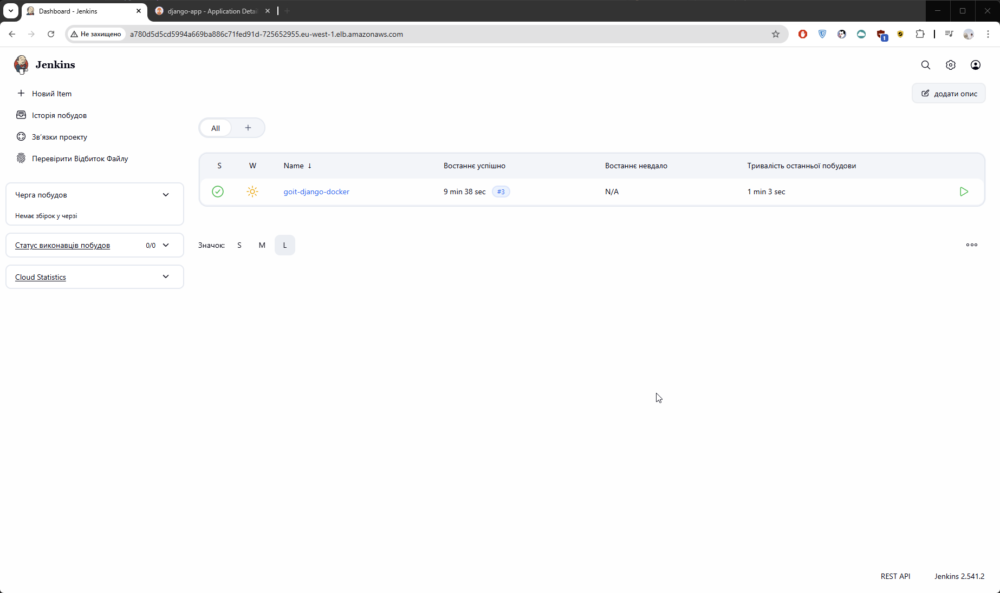
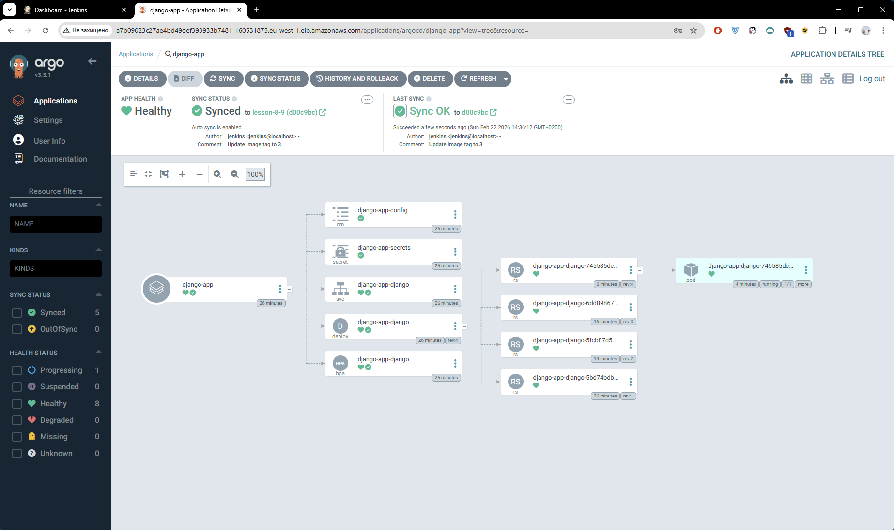
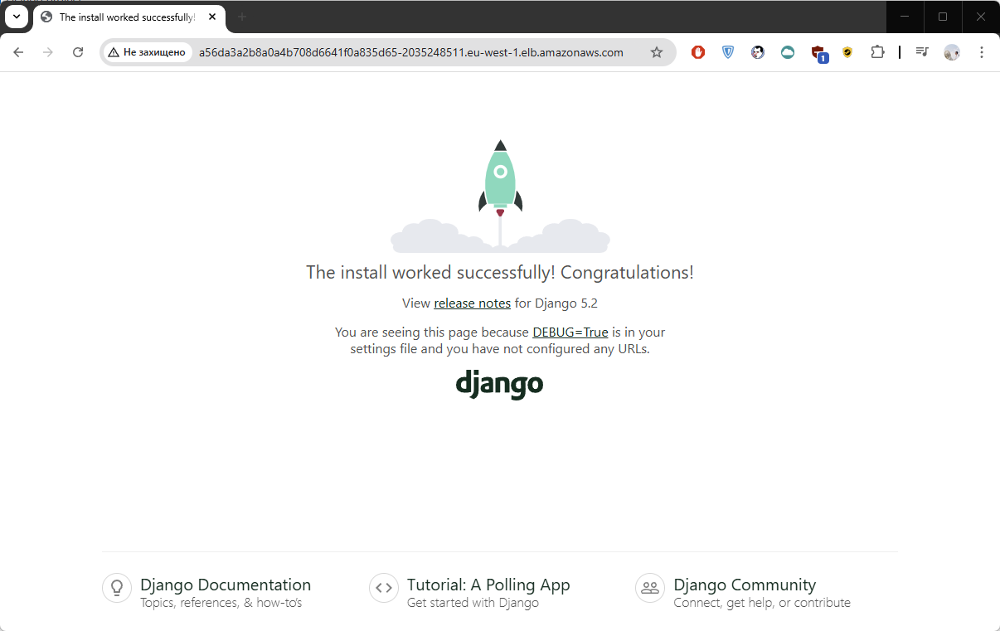
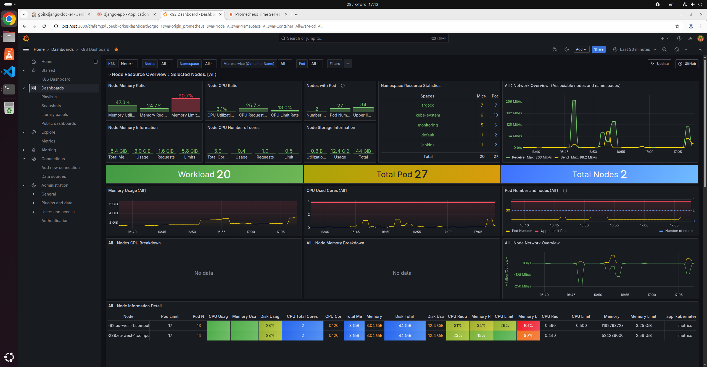
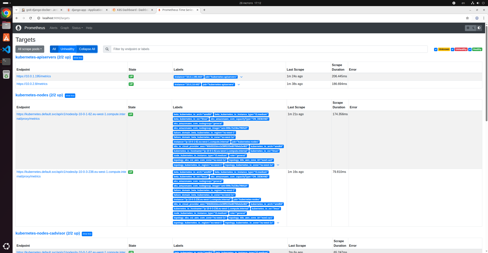

# Фінальний проєкт: Розгортання інфраструктури DevOps на AWS

Цей проєкт автоматично робить наступне:
-  Розгортає Kubernetes кластер (EKS) з підтримкою CI/CD
-  Інтегрує Jenkins для автоматизації збірки та деплою
-  Інсталює Argo CD для управління застосунками
-  Налаштовує бази даних (RDS або Aurora), в залежності від змінних
-  Організовую реєстр контейнерів (ECR)
-  Підключає моніторинг з Prometheus та Grafana
  
Працює з мінімальними змінами змінних і підтримує багаторазове використання.

## Структура проєкту

```
final-project/
│
├── main.tf                # Головний файл для підключення модулів
├── backend.tf             # Налаштування бекенду для стейтів S3 + DynamoDB
├── outputs.tf             # Загальні виводи ресурсів
├── Jenkinsfile            # Конфігурація дженкінса
├── variables.tf           # Змінні для підключення GitHub
├── versions.tf            # Налаштування версій модулів
│
├── modules/               # Каталог з усіма модулями
│   ├── rds/               # Модуль для RDS
│   ├── s3-backend/        # Модуль для S3 та DynamoDB
│   ├── vpc/               # Модуль для VPC
│   ├── ecr/               # Модуль для ECR
│   ├── eks/               # Модуль для Kubernetes кластера
│   ├── jenkins/           # Модуль для Jenkins
│   ├── argo_cd/           # Модуль для Argo CD
│   └── monitoring/        # Модуль для Моніторигу (Prometheus та Grafana)
│
├── charts/
│   └── django-app/        # Helm chart для застосунку
│
├── my_django_project/     # Django застосунок + Dockerfile
│
└── README.md              # Документація проєкту (цей файл)
```

## Команди для роботи

Спочатку створіть файл `terraform.tfvars` в корені проєкту з логіном та токеном від **GitHub** акаунту:
```bash
github_username = "ваш-логін"
github_token    = "ваш-токен"
```
Створіть інфраструктуру:
```bash
terraform apply
```
Коли інфраструктуру створено, налаштуйте **Kubernetes**:
```bash
aws eks update-kubeconfig --region eu-west-1 --name goit-lern-nkos-cluster
```
Перевірка стану ресурсів:
```bash
kubectl get all -n jenkins
kubectl get all -n argocd
kubectl get all -n monitoring
```

## Налаштування та параметри RDS модуля
Усі налаштування виконуються у файлі `main.tf` у модулі `RDS`:
  
```hcl
...
module "rds" {
  source = "./modules/rds"
  name                       = "myapp-db"
  use_aurora                 = false
  aurora_instance_count      = 2

  # --- Aurora-only ---
  engine_cluster             = "aurora-postgresql"
  engine_version_cluster     = "15.8"
  parameter_group_family_aurora = "aurora-postgresql15"
  
  # --- RDS-only ---
  engine                     = "postgres"
  engine_version             = "17.2"
  parameter_group_family_rds = "postgres17"

  # Common
  instance_class             = "db.t3.medium"
  allocated_storage          = 20
  db_name                    = "myapp"
  username                   = "postgres"
  password                   = "admin123AWS23"
  subnet_private_ids         = module.vpc.private_subnets
  subnet_public_ids          = module.vpc.public_subnets
  publicly_accessible        = true
  vpc_id                     = module.vpc.vpc_id
  multi_az                   = true
  backup_retention_period    = 7
  parameters = {
    max_connections              = "200"
    log_min_duration_statement   = "500"
  }

  tags = {
    Environment = "dev"
    Project     = "myapp"
  }
}
...
```

за допомогою наступних змінних:

| Змінна                   | Тип    | За замовченням                | Опис             
| ------------------------ | ------ | -------------------           | ----
| `name`                   | string | `myapp-db`                    | Назва БД
| `use_aurora`             | bool   | `false`                       | Aurora Cluster чи aws_db_instance
| `aurora_instance_count`  | int    | `2`                           | Кількість інстансів БД
| `engine`                 | string | `postgres`                    | Engine для RDS
| `engine_version`         | string | `17.2`                        | Версія для RDS
| `engine_cluster`         | string | `aurora-postgresql`           | Engine для Aurora
| `engine_version_cluster` | string | `15.8`                        | Версія для Aurora
| `instance_class`         | string | `db.t3.medium`                | Клас інстансу
| `allocated_storage`      | number | `20`                          | Диск в ГБ (RDS)
| `db_name`                | string | `myapp`                       | Ім'я бази
| `username`               | string | `postgres`                    | Користувач
| `password`               | string | `admin123AWS23`               | Пароль
| `subnet_private_ids`     | list   | `module.vpc.private_subnets`  | Приватні сабнети
| `subnet_public_ids`      | list   | `module.vpc.public_subnets`   | Публічні сабнети
| `publicly_accessible`    | bool   | `true`                        | Публічний доступ
| `vpc_id`                 | string | `module.vpc.vpc_id`           | VPC ID
| `multi_az`               | bool   | `true`                        | Multi-AZ
| `parameters`             | map    | `{}`                          | Параметри БД


### Змінити engine можна за допомогою наступних параметрів
наприклад з PostgreSQL на MySQL:
```hcl
# --- RDS ---
engine                     = "mysql"
engine_version             = "8.0"
parameter_group_family_rds = "mysql8.0"

# --- Aurora ---
engine_cluster                = "aurora-mysql"
engine_version_cluster        = "8.0.mysql_aurora.3.04.0"
parameter_group_family_aurora = "aurora-mysql8.0"
```

## Перевірка роботи Jenkins

Для отримання паролю запустити команду:
```bash
kubectl exec -n jenkins -it svc/jenkins -c jenkins -- /bin/cat /run/secrets/additional/chart-admin-password && echo
```
Щоб отримати тимчасовий доступ через портфорвардинг:
```bash
kubectl port-forward svc/jenkins 8080:8080 -n jenkins
```
Перейти за посиланням, ввести логін `admin` і пароль, який отримали вище та запустити білд **goit-django-docker** пайплайну
```bash
http://localhost:8080
```
#### Jenkins


## Перевірка роботи Argo CD

Для отримання паролю запустити команду:
```bash
kubectl -n argocd get secret argocd-initial-admin-secret -o jsonpath="{.data.password}" | base64 -d && echo
```
Щоб отримати тимчасовий доступ через портфорвардинг:
```bash
kubectl port-forward svc/argocd-server 8081:443 -n argocd
```
Перейти за посиланням, ввести логін `admin` і пароль, який отримали вище та перевірити **django-app** статус. Має бути **Synced, Healthy**
```bash
http://localhost:8080
```
#### ArgoCD


## Перевірка роботи Django

Для отримання `<EXTERNAL-IP>` запустити команду:
```bash
kubectl get svc -n default django-app-django
```
Перейти по `http://<EXTERNAL-IP>` адресі.

#### Django


## Перевірка роботи Grafana

Щоб отримати тимчасовий доступ через портфорвардинг:
```bash
kubectl port-forward svc/grafana 3000:80 -n monitoring
```
Перейти за посиланням, ввести логін `admin` і пароль `admin123`
```bash
http://localhost:3000
```
#### Grafana


## Перевірка роботи Prometheus

Щоб отримати тимчасовий доступ через портфорвардинг:
```bash
kubectl port-forward svc/prometheus-server 9090:80 -n monitoring
```
Перейти за посиланням:
```bash
http://localhost:9090
```
#### Prometheus

